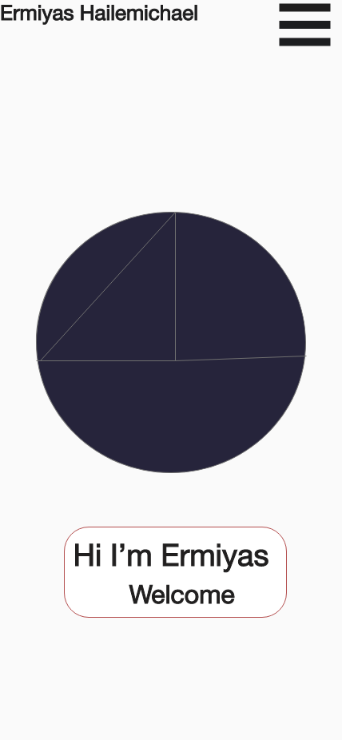
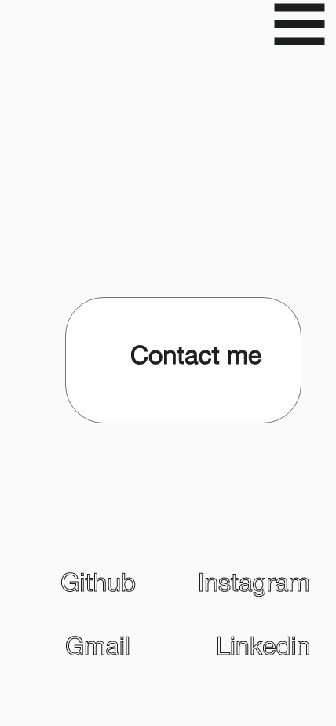

# Unit 1 Project Build A Portfolio Site

## Overview
This project will give you a chance to use the skills we've learned in class to create a site that highlights the skills and projects you'll be working on in SEI. You'll get a chance to use JavaScript to tackle interactions such as an image slider, a responsive hamburger menu, and quotes that fade in and out on a timer.

Make sure to customize the design and content of the website to make it your own.

You will be working individually for this project, but we'll be guiding you throughout the process and helping as you go.
- - - 
## Requirements
Your work must:
- Use semantic markup for HTML and CSS, adhering to best practices.
- Use CSS GRID and/or Flexbox.
- Must be mobile first, then tablet and desktop responsive.
- Must implement javascript to extend functionality by implementing 1 of the following
    1. AJAX requests
    2. Animations
    3. Javascript logic
    4. jQuery interactions
- Be deployed and accessible online via Github Pages (we will have a lesson on this process during project week)
- - - 

## Necessary Deliverables
- An About, Projects and Contact page.
- Site must be created using a "mobile first" approach.
- A Git repository, hosted on your personal GitHub, that includes a link to your hosted site. Site url should be in the form of githubusername.github.io.
- Repo must contain frequent commits (min 15+) dating back to the beginning of the project.
- An updated project worksheet with all sections filled out accordingly.
- An in-class demo of the site that shows off the interactions you worked on.

- - -
## Hungry For More?
If you're looking for an extra challenge, try tackling some of the tasks below:
- Add a contact us form that submits to Google Sheets or Firebase
- Add a skills section featuring skills you have/will have learned in the class.
- Add a image carousel
- Add a theme changer or dark/light mode
- Show the weather of your visitor using a 3rd party API

## Project Schedule

| Day |    Deliverable      |  Status | 
|-----|---------------------|---------|
|Day1 | Project Description |complete |
|Day2 | Wireframes / Priority Matrix / Timeline |complete |
|Day3 | Core Application Structure (HTML, CSS, etc.)| incomplete|
|Day4 | MVP & Bug Fixes |Incomplete|
|Day5 |	Final Touches| Incomplete|
|Day6 | Present|  Incomplete|

## Wireframes
    

## Time/Priority Matrix

## MVP

|Component|Priority|Estimated Time|	Actual Time|
|---------|--------|--------------|------------|
|Hamburger Menu|H|1hr|hr|
|Project Previews|H|3hr|hr|
|Regular Nav|H|1hr|hr|
|Adding Form|H|1.5hr|hr|
|Other sections and flex|M|3hr|hr|
|Working with API|H|3hr|hr|
|Responsive|H|3hr|hr|
|Social Media Icons|L|1hr|hr|
|Total|H|15.5hrs|hrs|

|Component|Priority|Estimated Time|	Actual Time|
|---------|--------|--------------|------------|
|Project Hover|L|3hr|-hr|
|Project Hover|L|1hr|hr|
|Interactive Banner|M|4hr|hr|
|Materialize|H|4hr|-hr|
|Bootstrap|H|4hr|hr|
|Make own icon|L|4hr|hr|
|Make own icon|H|20hrs|hrs|

## Additional Libraries Used

## Code Snippet

## Issues and Resolutions